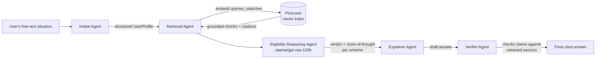

# 🇪🇺 EU Benefits Navigator

A multi-agent, RAG-grounded assistant that helps people find social benefits they're
entitled to but haven't claimed.

## The problem

Across the EU, studies consistently find that a large share of eligible people — pensioners,
low-income households, migrants, disabled citizens — never claim social benefits (housing aid,
minimum income support, healthcare allowances, family benefits, energy support) they qualify
for. Not because they don't need the money, but because eligibility rules are scattered across
dozens of national agency websites, written in dense bureaucratic language, and never
cross-referenced against an individual's actual situation. Unlike crowded spaces like housing
search or immigration chatbots, this "benefit non-take-up" problem has almost no consumer-facing
AI tooling — despite estimates putting unclaimed benefits in the billions of euros annually.

This project is a working prototype: describe your situation in plain language, and a pipeline
of specialist agents retrieves relevant, real benefit schemes, reasons step-by-step about your
eligibility against the actual published rules, and returns a cited, self-verified answer.

**This is not legal or financial advice.** It's a portfolio project covering a representative
sample of real schemes across 7 EU/EEA countries — always confirm on the official page before
relying on anything it says.

## Architecture



| Agent | Role | Model |
|---|---|---|
| **Intake** | Parses free text into a structured profile (country, age, employment, household, income band, residency status, detected language) | Groq `llama-3.3-70b-versatile` |
| **Retrieval** | Builds category-spanning queries from the profile, embeds them locally, and searches Pinecone for grounded scheme text | `sentence-transformers` (local, free) + Pinecone |
| **Eligibility Reasoning** | For each candidate scheme, reasons step-by-step over each criterion vs. the user's facts; flags missing information instead of guessing | Groq `openai/gpt-oss-120b` (`reasoning_effort="high"`) |
| **Explainer** | Synthesizes assessments into a warm, plain-language answer with next steps, in the user's own language | Groq `llama-3.3-70b-versatile` |
| **Verifier** | Cross-checks every claim in the draft against the actual retrieved source text; strips or softens anything unsupported | Groq `llama-3.3-70b-versatile` |

The full reasoning trace — not just the final answer — is preserved through the pipeline
(`src/agents/state.py`) so the UI can show *why* the system reached each verdict.

## Data

`data/schemes/` contains 12 real, publicly documented benefit schemes across 7 countries
(Germany, France, Poland, Portugal, Netherlands, Ireland, Spain, Italy), each with a real
source URL: housing benefits, minimum income schemes, healthcare allowances, family benefits,
and energy/fuel support. `data/ingest.py` chunks these by section, embeds them, and upserts
them into Pinecone with metadata for citation. The schema is designed to make adding more
countries/schemes a matter of dropping in another markdown file.

## Stack

- **Python 3.11+**
- **LangGraph** — multi-agent orchestration
- **Groq** — free-tier LLM inference (no credit card required), with per-agent model routing
- **Pinecone** — serverless vector database
- **sentence-transformers** — local, free, multilingual embeddings (no embedding API cost)
- **Streamlit** — demo UI

## Setup

```bash
python -m venv .venv
.venv\Scripts\activate   # or `source .venv/bin/activate` on macOS/Linux
pip install -r requirements.txt

cp .env.example .env
# Add your free Groq key (console.groq.com/keys) and Pinecone key (app.pinecone.io) to .env

python data/ingest.py    # one-time: embed and upsert the seed schemes into Pinecone
streamlit run app.py
```

## Tests

```bash
pytest tests/
```

Tests mock the LLM and vector store, so they run without any API keys.

## Disclaimer

This tool provides general, AI-generated guidance based on a sample of publicly available
benefit-scheme summaries. It is **not** legal, tax, or financial advice, may not reflect the
latest rule changes, and does not cover every scheme or country. Always verify eligibility
and current amounts on the relevant official government website before applying.
